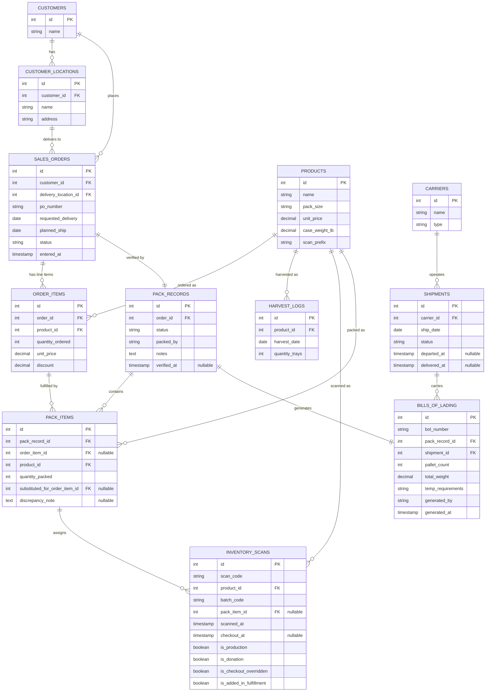

# HOLO Data Model
## Harvest and Order Logistics Operations

---

## Overview

This document defines the proposed data model for HOLO, designed to address the structural gaps in Hippo Harvest's current database. The model introduces normalization, explicit status tracking, and a pack verification layer that creates an unbroken data chain from harvest through invoicing.

The core principle: **every entity that is currently a free-text field, a Google Doc, or something carried in someone's head becomes a queryable, structured record.**

---

## Entity Relationship Diagram

The diagram maps the traceability chain described below: a harvested tray becomes a scanned case, gets assigned to a pack item during verification, is recorded on a BOL, and is shipped under a carrier — all joinable through the foreign keys shown above.

---

## Tables

### CUSTOMERS

Replaces the redundant `customer` / `retailer` free-text columns on every order. Single source of truth for customer identity.

| Field | Type | Notes |
|-------|------|-------|
| id | int, PK | |
| name | string | e.g., "Bay Leaf Markets" |

**Why this is new:** The current schema stores customer name, retailer name, and location as free text on every order row — all three are identical in every record. Normalizing to a customers table eliminates redundancy and makes it possible to update a customer's details in one place.

---

### CUSTOMER_LOCATIONS

Separate table because a customer can have multiple receiving docks (e.g., a regional grocer with stores in several cities). Address belongs to the location, not the customer.

| Field | Type | Notes |
|-------|------|-------|
| id | int, PK | |
| customer_id | int, FK → CUSTOMERS | |
| name | string | e.g., "Bay Leaf - Palo Alto" |
| address | string | Full delivery address |

**Why this is new:** The current schema couples `location` directly to each order as free text. Splitting it out means a second location for the same customer doesn't create a parallel customer row, and `SALES_ORDERS.delivery_location_id` FKs cleanly. In the sample data every customer has one location, but the model should not assume 1:1.

---

### PRODUCTS

Maps product descriptions to scan code prefixes, connecting the inventory and order systems that are currently disconnected.

| Field | Type | Notes |
|-------|------|-------|
| id | int, PK | |
| name | string | e.g., "Spring Mix" |
| pack_size | string | e.g., "6 x 4.5 oz" |
| unit_price | decimal | Default price (can be overridden on order items) |
| case_weight_lb | decimal | Per-case weight, used to compute `BILLS_OF_LADING.total_weight` |
| scan_prefix | string | Maps to inventory scan codes, e.g., "og-9024" → Spring Mix |

**Why this is new:** This is the most critical structural gap in the current schema. Two independent product identifiers exist today with no table joining them: the free-text `sku_description` on order line items (e.g., "Spring Mix 6 x 4.5 oz") and the scan-code prefixes on inventory scans (e.g., `og-9024-25A09-0001`). `products` reconciles the two so scans and order lines can be joined to a single record. The `case_weight_lb` column is what makes `BILLS_OF_LADING.total_weight` computable instead of hardcoded.

---

### SALES_ORDERS

Adds explicit status tracking and replaces free-text fields with foreign keys.

| Field | Type | Notes |
|-------|------|-------|
| id | int, PK | |
| customer_id | int, FK → CUSTOMERS | |
| delivery_location_id | int, FK → CUSTOMER_LOCATIONS | Which dock this order ships to |
| po_number | string | Customer's purchase order reference |
| requested_delivery | date | Customer-requested delivery date |
| planned_ship | date | Internal planned ship date |
| status | string | `entered` → `fulfilled` ·or· `partially_fulfilled` → `released` → `delivered` · `cancelled` |
| entered_at | timestamp | When the order was created |

**What changed:**
- `customer` and `retailer` columns replaced by `customer_id` FK — eliminates redundancy.
- `location` free-text column replaced by `delivery_location_id` FK → `CUSTOMER_LOCATIONS`.
- `delivery_date` and `customer_requested_delivery_date` were identical in every record; collapsed to `requested_delivery` and `planned_ship` which have distinct meanings.
- Explicit `status` field replaces the pattern of inferring order state from which timestamps (`fulfilled_timestamp`, `released_timestamp`, `delivered_timestamp`) are populated. Status transitions are now explicit and queryable. `partially_fulfilled` covers the real case seen in the sample data where the packed quantity is less than the ordered quantity (order 1003 shipped 5 of 6 Spring Mix); `cancelled` gives the state machine a terminal off-ramp.
- `order_type_selector` removed — all records were "Purchase Order."
- `bol_photo_url` removed — BOLs are now structured records, not photos.
- `load_id` free-text field replaced by the SHIPMENTS / BILLS_OF_LADING relationship.
- `percent_discount` moved to the line-item level where it belongs.

---

### ORDER_ITEMS

Line items for a sales order. Now references products by ID instead of storing free-text descriptions.

| Field | Type | Notes |
|-------|------|-------|
| id | int, PK | |
| order_id | int, FK → SALES_ORDERS | |
| product_id | int, FK → PRODUCTS | |
| quantity_ordered | int | Number of cases ordered |
| unit_price | decimal | Price per case for this order (may differ from default) |
| discount | decimal | Line-level discount |

**What changed:**
- `sku_description` free-text column replaced by `product_id` FK — enables joins to products, inventory, and pack items.
- `gross_line_value` and `net_line_value` removed — these are computed fields (`quantity × unit_price - discount`) and should be calculated at query time rather than stored.

---

### HARVEST_LOGS

Records what was harvested each day, by product.

| Field | Type | Notes |
|-------|------|-------|
| id | int, PK | |
| product_id | int, FK → PRODUCTS | |
| harvest_date | date | |
| quantity_trays | int | Number of trays harvested |

**Why this is new:** Harvest data currently lives in Google Chat messages and spreadsheets. Structuring it enables the Inventory & Orders Dashboard — the "one place to see what's been harvested, what's committed, and what still needs packing" that Maria asked for. Cold-chain state (fresh vs cooler) is **not** captured here — it's derived from `INVENTORY_SCANS.checkout_at IS NULL` per the case study's own definition of cooler stock.

---

### INVENTORY_SCANS

Individual case/tray scans. Now linked to products and (after packing) to specific pack items for full traceability.

| Field | Type | Notes |
|-------|------|-------|
| id | int, PK | |
| scan_code | string | Full barcode, e.g., `og-9024-25A09-0001` |
| product_id | int, FK → PRODUCTS | Derived from scan code prefix via products.scan_prefix |
| batch_code | string | Middle segment of scan code (e.g., `25A09`) identifying the harvest batch |
| pack_item_id | int, FK → PACK_ITEMS, nullable | Set when this scan is assigned to a packed line item |
| scanned_at | timestamp | When the case was scanned off the line |
| checkout_at | timestamp, nullable | When the case was released to the truck. **Null = still in cooler** (per the case study's definition). |
| is_production | boolean | |
| is_donation | boolean | |
| is_checkout_overridden | boolean | Operator scanned this case against a different order than the system expected |
| is_added_in_fulfillment | boolean | Ad-hoc case added at the pack table (not pre-allocated from the order) |

**What changed:**
- `customer_order_id` and `customer_order_item_id` replaced by `pack_item_id`. The current schema links scans to orders but never to specific line items (the `customer_order_item_id` column is empty in every record). The new model links scans to pack items, which in turn link to products — completing the traceability chain.
- `product_id` added — derived from scan code prefix lookup, making it possible to aggregate scanned inventory by product.
- `batch_code` added — parsed from the middle segment of the scan code. Food-safety recalls operate on harvest batches, so this needs to be a first-class column (not buried inside `scan_code`). Optional follow-up: a `HARVEST_BATCHES` table keyed by `batch_code` for aggregate batch metadata.
- `is_checkout_overridden` and `is_added_in_fulfillment` kept as per-scan booleans. Collapsing them into a pack-record note would destroy per-case signal — and scan 835 in the sample data has both set, so this is a real operational case that the model has to preserve.

---

### PACK_RECORDS

The verification layer — one record per order packing session. This is the core new entity that HOLO introduces.

| Field | Type | Notes |
|-------|------|-------|
| id | int, PK | |
| order_id | int, FK → SALES_ORDERS | |
| status | string | `draft` → `verified` → `locked` |
| packed_by | string | Who performed/verified the packing |
| notes | text | General notes about this packing session |
| verified_at | timestamp, nullable | When the pack record was verified and locked |

**Why this is new:** There is currently no record of what was actually packed for an order. The `fulfilled_timestamp` on the order indicates packing happened, but not what was packed, whether it matched the order, who verified it, or whether there were any issues. This table closes that gap.

---

### PACK_ITEMS

Individual line items within a pack record — what was actually packed per product, compared against what was ordered.

| Field | Type | Notes |
|-------|------|-------|
| id | int, PK | |
| pack_record_id | int, FK → PACK_RECORDS | |
| order_item_id | int, FK → ORDER_ITEMS, nullable | The order line this pack item fulfills; null for ad-hoc adds |
| product_id | int, FK → PRODUCTS | |
| quantity_packed | int | Actual number of cases packed |
| substituted_for_order_item_id | int, FK → ORDER_ITEMS, nullable | If this is a substitute for a different ordered product, points to the original line |
| discrepancy_note | text, nullable | e.g., "Short 2 cases — quality pull", "Customer approved substitution" |

**Why this is new:** This is where the order-vs-reality comparison happens. By joining `PACK_ITEMS.order_item_id` against `ORDER_ITEMS.quantity_ordered`, the system can flag discrepancies before the BOL is generated — catching mismatches that currently aren't discovered until invoicing.

The `order_item_id` FK is necessary because an order can have two line items for the same product (different unit prices, different allocations) — matching on `product_id` alone is ambiguous. `substituted_for_order_item_id` makes substitutions structured instead of buried in the free-text `discrepancy_note`, which means substitution reporting becomes a simple query.

---

### BILLS_OF_LADING

Generated from verified pack data. Replaces the Google Doc template and photo-based workflow.

| Field | Type | Notes |
|-------|------|-------|
| id | int, PK | |
| bol_number | string | Unique BOL identifier |
| pack_record_id | int, FK → PACK_RECORDS | Links BOL to verified pack data |
| shipment_id | int, FK → SHIPMENTS | |
| pallet_count | int | |
| total_weight | decimal | Computed at generation from `Σ(pack_items.quantity_packed × products.case_weight_lb)` |
| temp_requirements | string | e.g., "34–38°F" |
| generated_by | string | Who generated the BOL |
| generated_at | timestamp | |

**What changed:** The BOL is no longer a photo of a Google Doc (`bol_photo_url`). It's a structured, queryable record generated from the verified pack record. This means Priya can query historical BOLs by date, customer, product, or carrier — no more hunting through email attachments.

---

### SHIPMENTS

Replaces the free-text `load_id` field with a proper shipments table.

| Field | Type | Notes |
|-------|------|-------|
| id | int, PK | |
| carrier_id | int, FK → CARRIERS | |
| ship_date | date | |
| status | string | `scheduled` → `in_transit` → `delivered` |
| departed_at | timestamp, nullable | |
| delivered_at | timestamp, nullable | |

**Why this is new:** The current `load_id` is a free-text string like "Hippo Truck 2025-03-03". This works for one truck but won't scale when overflow carriers are added. A proper shipments table supports multiple carriers, delivery tracking, and links cleanly to BOLs.

---

### CARRIERS

Lookup table for carriers.

| Field | Type | Notes |
|-------|------|-------|
| id | int, PK | |
| name | string | e.g., "Hippo Truck", overflow carrier name |
| type | string | `internal` or `external` |

---

## Key Data Flows

### Harvest → Pack → Ship → Invoice

1. Robots harvest overnight. **HARVEST_LOGS** records trays by product and date.
2. Individual cases are scanned off the line → **INVENTORY_SCANS** with `product_id` derived from scan code prefix and `batch_code` parsed from the middle segment.
3. Operations manager views the **Inventory & Orders Dashboard**. Cooler stock = count of `INVENTORY_SCANS` where `checkout_at IS NULL`. Harvested-today is derived from `HARVEST_LOGS`. Committed = open `ORDER_ITEMS.quantity_ordered`. Gap = on-hand − committed.
4. During packing, a **PACK_RECORD** is created for the order. **PACK_ITEMS** log what was actually packed per product. Scans are linked to pack items via `pack_item_id`.
5. System compares `PACK_ITEMS.quantity_packed` against `ORDER_ITEMS.quantity_ordered` (joined via `pack_items.order_item_id`) and flags discrepancies. If the order was short-picked, `SALES_ORDERS.status` becomes `partially_fulfilled`.
6. Once verified, the pack record is locked → **BILL_OF_LADING** is generated from verified data, with `total_weight` computed from `case_weight_lb × quantity_packed`.
7. BOL is linked to a **SHIPMENT** with carrier details and delivery tracking.
8. Business team queries `BILLS_OF_LADING` joined to `PACK_ITEMS` and `ORDER_ITEMS` for invoice reconciliation — no manual cross-referencing needed.

### Traceability Chain

For any given case of product, the system can answer: *When was it harvested? What scan code does it have? Which order was it packed for? Was there a discrepancy? What BOL was it on? Who was the carrier? When was it delivered?*

`INVENTORY_SCANS` → `PACK_ITEMS` → `PACK_RECORDS` → `BILLS_OF_LADING` → `SHIPMENTS`

This chain is unbroken and queryable — addressing the food safety and audit concerns raised in discovery.

---

## Source-data mapping

The model is derivable from the three sample CSVs.

| File | Rows | Role in the model |
|---|---|---|
| `customer_orders.csv` | 10 | Populates `SALES_ORDERS`, `CUSTOMERS`, `CUSTOMER_LOCATIONS`; `load_id` → `SHIPMENTS` |
| `customer_order_items.csv` | 24 | Populates `ORDER_ITEMS`; `sku_description` seeds `PRODUCTS.name + pack_size` |
| `inventory_scans.csv` | 62 | Populates `INVENTORY_SCANS`; scan-code prefix seeds `PRODUCTS.scan_prefix`; rows with `checkout_timestamp IS NULL` are cooler stock on the dashboard |

Products exist under two independent identifiers in the source data, and `PRODUCTS` is where they converge:

| System | Example | Source column |
|---|---|---|
| Free-text description | `Spring Mix 6 x 4.5 oz` | `customer_order_items.sku_description` |
| Scan prefix | `og-9024` | First two segments of `inventory_scans.scan_code` |

The mapping between the two is inferred from co-occurrence: an order whose line items list `Spring Mix 6 x 4.5 oz` ships with scans whose prefix is `og-9024`, so those two identifiers describe the same product.

Validation against the sample data confirmed the model handles:
- A real partial-fulfillment case (order 1003 shipped 5 of 6 Spring Mix) — covered by `SALES_ORDERS.status = partially_fulfilled` and `PACK_ITEMS.quantity_packed < ORDER_ITEMS.quantity_ordered`.
- A real ad-hoc box at the pack table (scan 835 has `is_checkout_overridden` + `is_added_in_fulfillment` both set) — covered by retaining both flags on `INVENTORY_SCANS`.

---

## Open gaps / deferred decisions

Items considered during the sample-data review but **not** incorporated in the current schema. Carried into the PRD as follow-ups.

| # | Gap | Recommendation | Deferred because |
|---|---|---|---|
| 1 | `packed_by` / `generated_by` are strings, no `USERS` table | Add `USERS` + FK | Not blocking for prototype; trivial to add later |
| 2 | `INVENTORY_SCANS` has no FK to `HARVEST_LOGS` — linked only by product + date | Add `harvest_log_id` FK | Date-based join is adequate while sample volume is small |
| 3 | `SALES_ORDERS.fulfilled_timestamp` semantics overlap with `PACK_RECORDS.verified_at` | Pick one source of truth (likely drop from orders, derive via query) | Needs a quick stakeholder confirm before removing |
| 4 | `is_donation` is a boolean but donations have no recipient, no delivery date | `DONATION_RECIPIENTS` table + pseudo-order flow | No donations in sample; ship when the flow is defined |
| 5 | Locked `PACK_RECORDS` cannot be safely amended (audit break) | Append-only versioning or `superseded_by_id` column | Prototype treats lock as final; revisit for production |
| 6 | `customer` and `retailer` were separate columns in the source but always identical | Potentially split back into `customer_id` + `retailer_id` | Stakeholder-gated (see Question 1 below) |
| 7 | `ORDER_ITEMS.discount` unit (dollars vs percent) untestable — sample is 0 everywhere | Add a unit constraint / column | Cosmetic; confirm with finance before choosing |
| 8 | Batch code on `INVENTORY_SCANS` is parsed but `HARVEST_BATCHES` table is not modeled | Promote to its own table keyed by `batch_code` | Current flat column is enough for recall queries; promote if batch-level metadata (origin tray, robot route) becomes important |

## Questions for stakeholders

Confirming these would tighten the model or collapse deferred items above.

1. **Does a customer ever have multiple delivery locations?** Drives whether `CUSTOMER_LOCATIONS` stays separate (yes) or collapses back onto `CUSTOMERS` (no).
2. **Does case weight vary by harvest run or only by SKU?** If only by SKU, `PRODUCTS.case_weight_lb` is sufficient. If it varies, weight belongs on `PACK_ITEMS` or `HARVEST_LOGS`.
3. **When an ad-hoc box is added at the pack table, is it always for the same SKU, or does it substitute a different SKU?** Confirms whether `substituted_for_order_item_id` is the right structure.
4. **Is the batch segment (`25A09`) assigned by the robots per harvest run, or per individual tray?** Drives whether `HARVEST_BATCHES` is worth promoting to its own table.
5. **Will `retailer` ever differ from `customer` in practice?** If yes, re-introduce `SALES_ORDERS.retailer_id`.
6. **For order 1003's short pick — how does that reconcile today against the BOL and the invoice?** Confirms `partially_fulfilled` solves a real pain rather than a sample-data artifact.
