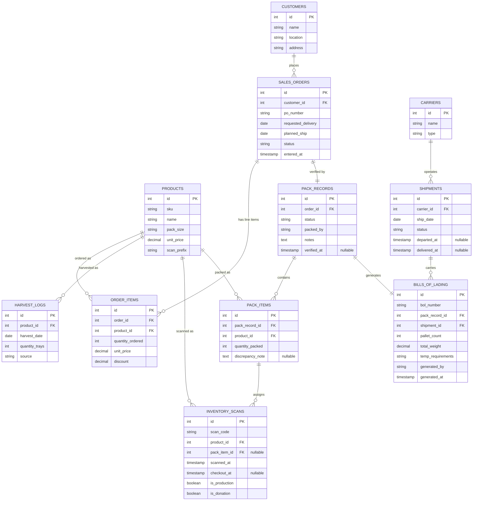

# HOLO Data Model
## Harvest and Order Logistics Operations

---

## Overview

This document defines the proposed data model for HOLO, designed to address the structural gaps in Hippo Harvest's current database. The model introduces normalization, explicit status tracking, and a pack verification layer that creates an unbroken data chain from harvest through invoicing.

The core principle: **every entity that is currently a free-text field, a Google Doc, or something carried in someone's head becomes a queryable, structured record.**

---

## Entity Relationship Diagram

The diagram maps the traceability chain described below: a harvested tray becomes a scanned case, gets assigned to a pack item during verification, is recorded on a BOL, and is shipped under a carrier — all joinable through the foreign keys shown above.

---

## Tables

### CUSTOMERS

Replaces the redundant `customer` / `retailer` free-text columns on every order. Single source of truth for customer identity and delivery locations.

| Field | Type | Notes |
|-------|------|-------|
| id | int, PK | |
| name | string | e.g., "Bay Leaf Markets" |
| location | string | e.g., "Bay Leaf - Palo Alto" |
| address | string | Full delivery address |

**Why this is new:** The current schema stores customer name, retailer name, and location as free text on every order row — all three are identical in every record. Normalizing to a customers table eliminates redundancy and makes it possible to update a customer's details in one place.

---

### PRODUCTS

Maps SKU descriptions to scan code prefixes, connecting the inventory and order systems that are currently disconnected.

| Field | Type | Notes |
|-------|------|-------|
| id | int, PK | |
| sku | string | Unique SKU code |
| name | string | e.g., "Spring Mix" |
| pack_size | string | e.g., "6 x 4.5 oz" |
| unit_price | decimal | Default price (can be overridden on order items) |
| scan_prefix | string | Maps to inventory scan codes, e.g., "og-9024" → Spring Mix |

**Why this is new:** This is the most critical structural gap in the current schema. Today, SKU descriptions exist only as free text on order line items (e.g., "Spring Mix 6 x 4.5 oz"), and inventory scans use encoded scan codes (e.g., `og-9024-25A09-0001`) with no documented mapping to products. The `scan_prefix` field bridges these two systems, enabling traceability from scan to product to order.

---

### SALES_ORDERS

Adds explicit status tracking and replaces free-text fields with foreign keys.

| Field | Type | Notes |
|-------|------|-------|
| id | int, PK | |
| customer_id | int, FK → CUSTOMERS | |
| po_number | string | Customer's purchase order reference |
| requested_delivery | date | Customer-requested delivery date |
| planned_ship | date | Internal planned ship date |
| status | string | `entered` → `fulfilled` → `released` → `delivered` |
| entered_at | timestamp | When the order was created |

**What changed:**
- `customer` and `retailer` columns replaced by `customer_id` FK — eliminates redundancy.
- `delivery_date` and `customer_requested_delivery_date` were identical in every record; collapsed to `requested_delivery` and `planned_ship` which have distinct meanings.
- Explicit `status` field replaces the pattern of inferring order state from which timestamps (`fulfilled_timestamp`, `released_timestamp`, `delivered_timestamp`) are populated. Status transitions are now explicit and queryable.
- `order_type_selector` removed — all records were "Purchase Order."
- `bol_photo_url` removed — BOLs are now structured records, not photos.
- `load_id` free-text field replaced by the SHIPMENTS / BILLS_OF_LADING relationship.
- `percent_discount` moved to the line-item level where it belongs.

---

### ORDER_ITEMS

Line items for a sales order. Now references products by ID instead of storing free-text descriptions.

| Field | Type | Notes |
|-------|------|-------|
| id | int, PK | |
| order_id | int, FK → SALES_ORDERS | |
| product_id | int, FK → PRODUCTS | |
| quantity_ordered | int | Number of cases ordered |
| unit_price | decimal | Price per case for this order (may differ from default) |
| discount | decimal | Line-level discount |

**What changed:**
- `sku_description` free-text column replaced by `product_id` FK — enables joins to products, inventory, and pack items.
- `gross_line_value` and `net_line_value` removed — these are computed fields (`quantity × unit_price - discount`) and should be calculated at query time rather than stored.

---

### HARVEST_LOGS

Records what was harvested each day, by product and source.

| Field | Type | Notes |
|-------|------|-------|
| id | int, PK | |
| product_id | int, FK → PRODUCTS | |
| harvest_date | date | |
| quantity_trays | int | Number of trays harvested |
| source | string | `fresh` or `cooler` |

**Why this is new:** Harvest data currently lives in Google Chat messages and spreadsheets. Structuring it enables the Inventory & Orders Dashboard — the "one place to see what's been harvested, what's committed, and what still needs packing" that Maria asked for.

---

### INVENTORY_SCANS

Individual case/tray scans. Now linked to products and (after packing) to specific pack items for full traceability.

| Field | Type | Notes |
|-------|------|-------|
| id | int, PK | |
| scan_code | string | Full barcode, e.g., `og-9024-25A09-0001` |
| product_id | int, FK → PRODUCTS | Derived from scan code prefix via products.scan_prefix |
| pack_item_id | int, FK → PACK_ITEMS, nullable | Set when this scan is assigned to a packed line item |
| scanned_at | timestamp | When the case was scanned off the line |
| checkout_at | timestamp, nullable | When the case was checked out for an order |
| is_production | boolean | |
| is_donation | boolean | |

**What changed:**
- `customer_order_id` and `customer_order_item_id` replaced by `pack_item_id`. The current schema links scans to orders but never to specific line items (the `customer_order_item_id` column is empty in every record). The new model links scans to pack items, which in turn link to products — completing the traceability chain.
- `product_id` added — derived from scan code prefix lookup, making it possible to aggregate scanned inventory by product.
- `is_checkout_overridden` and `is_added_in_fulfillment` removed — these exception flags are better captured as notes on the pack record.

---

### PACK_RECORDS

The verification layer — one record per order packing session. This is the core new entity that HOLO introduces.

| Field | Type | Notes |
|-------|------|-------|
| id | int, PK | |
| order_id | int, FK → SALES_ORDERS | |
| status | string | `draft` → `verified` → `locked` |
| packed_by | string | Who performed/verified the packing |
| notes | text | General notes about this packing session |
| verified_at | timestamp, nullable | When the pack record was verified and locked |

**Why this is new:** There is currently no record of what was actually packed for an order. The `fulfilled_timestamp` on the order indicates packing happened, but not what was packed, whether it matched the order, who verified it, or whether there were any issues. This table closes that gap.

---

### PACK_ITEMS

Individual line items within a pack record — what was actually packed per product, compared against what was ordered.

| Field | Type | Notes |
|-------|------|-------|
| id | int, PK | |
| pack_record_id | int, FK → PACK_RECORDS | |
| product_id | int, FK → PRODUCTS | |
| quantity_packed | int | Actual number of cases packed |
| discrepancy_note | text, nullable | e.g., "Short 2 cases — quality pull", "Customer approved substitution" |

**Why this is new:** This is where the order-vs-reality comparison happens. By joining `PACK_ITEMS.product_id` and `PACK_ITEMS.quantity_packed` against `ORDER_ITEMS.product_id` and `ORDER_ITEMS.quantity_ordered` for the same order, the system can flag discrepancies before the BOL is generated — catching mismatches that currently aren't discovered until invoicing.

---

### BILLS_OF_LADING

Generated from verified pack data. Replaces the Google Doc template and photo-based workflow.

| Field | Type | Notes |
|-------|------|-------|
| id | int, PK | |
| bol_number | string | Unique BOL identifier |
| pack_record_id | int, FK → PACK_RECORDS | Links BOL to verified pack data |
| shipment_id | int, FK → SHIPMENTS | |
| pallet_count | int | |
| total_weight | decimal | |
| temp_requirements | string | e.g., "34–38°F" |
| generated_by | string | Who generated the BOL |
| generated_at | timestamp | |

**What changed:** The BOL is no longer a photo of a Google Doc (`bol_photo_url`). It's a structured, queryable record generated from the verified pack record. This means Priya can query historical BOLs by date, customer, product, or carrier — no more hunting through email attachments.

---

### SHIPMENTS

Replaces the free-text `load_id` field with a proper shipments table.

| Field | Type | Notes |
|-------|------|-------|
| id | int, PK | |
| carrier_id | int, FK → CARRIERS | |
| ship_date | date | |
| status | string | `scheduled` → `in_transit` → `delivered` |
| departed_at | timestamp, nullable | |
| delivered_at | timestamp, nullable | |

**Why this is new:** The current `load_id` is a free-text string like "Hippo Truck 2025-03-03". This works for one truck but won't scale when overflow carriers are added. A proper shipments table supports multiple carriers, delivery tracking, and links cleanly to BOLs.

---

### CARRIERS

Lookup table for carriers.

| Field | Type | Notes |
|-------|------|-------|
| id | int, PK | |
| name | string | e.g., "Hippo Truck", overflow carrier name |
| type | string | `internal` or `external` |

---

## Key Data Flows

### Harvest → Pack → Ship → Invoice

1. Robots harvest overnight. **HARVEST_LOGS** records trays by product and date.
2. Individual cases are scanned off the line → **INVENTORY_SCANS** with `product_id` derived from scan code prefix.
3. Operations manager views the **Inventory & Orders Dashboard**: harvest logs + unassigned scans vs. open order items. Sees gaps at a glance.
4. During packing, a **PACK_RECORD** is created for the order. **PACK_ITEMS** log what was actually packed per product. Scans are linked to pack items via `pack_item_id`.
5. System compares `PACK_ITEMS.quantity_packed` against `ORDER_ITEMS.quantity_ordered` and flags discrepancies.
6. Once verified, the pack record is locked → **BILL_OF_LADING** is generated from verified data with accurate quantities.
7. BOL is linked to a **SHIPMENT** with carrier details and delivery tracking.
8. Business team queries `BILLS_OF_LADING` joined to `PACK_ITEMS` and `ORDER_ITEMS` for invoice reconciliation — no manual cross-referencing needed.

### Traceability Chain

For any given case of product, the system can answer: *When was it harvested? What scan code does it have? Which order was it packed for? Was there a discrepancy? What BOL was it on? Who was the carrier? When was it delivered?*

`INVENTORY_SCANS` → `PACK_ITEMS` → `PACK_RECORDS` → `BILLS_OF_LADING` → `SHIPMENTS`

This chain is unbroken and queryable — addressing the food safety and audit concerns raised in discovery.
